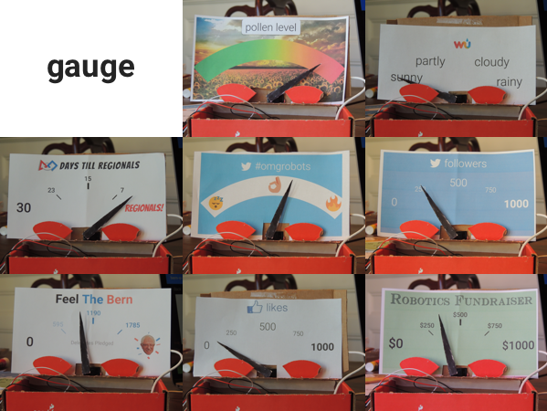
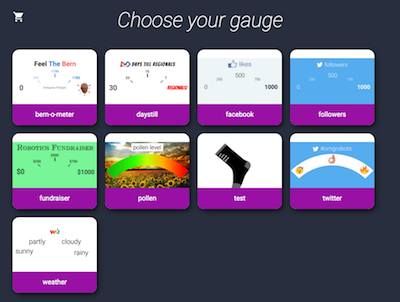
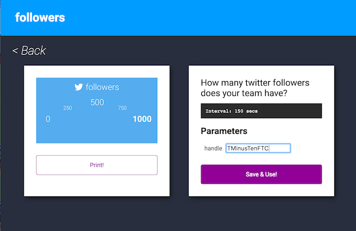

##Interchangeable, connected gauges.

T-10 (FTC 4096)'s entry for the imaginethis.io IoT competition

**gauge** opens your tabletop into a world of Internet-connected data possibilities. Simply select the data you'd like to show, and print the unique gauge face to affix to your device.

The data your gauge can display ranges from the weather, to presidential delegate count, to days until your FTC Robotics team's regional competition. With minimal setup, a small servo and Particle Photon can be turned into a magical blend of analog and digital, representing the vast metrics that the internet today has to offer.

And it's fully automated and easily customizable, thanks to our web interface and servo daemon.

##FIRST Robotics

As the need for an online presence of FIRST teams has only been increasing, it's important to keep track of the metrics which can define a team's success in outreach.

From the number of a team's twitter followers, to the success of a hashtag, to the progress of a GoFundMe fundraiser, displaying this information in a personal, passive setting can prove extremely useful.

Support for metrics such as these are built-in to the gauge project. You can simply select, configure and print any metric to your desire within seconds. Our server will then query the corresponding web services automatically.

*The facebook gauge and configuration in action. The likes are polled automatically every few minutes from facebook.com after the user defines which page to represent.*

*The wunderground gauge updated regularly to the forecasted conditions in the given area, allowing for easy indication of the local weather.*

##The Technology

Hardware-wise, we used a Particle Photon generously provided by Microsoft/FIRST, as well as a standard PWM servo.

For software, as the emphasis was web services, we opted for a Node.JS web stack. In particular, we used the Express web framework, the Pug templating engine, and Particle's own API wrapper to control the hardware. To scrape data, we used a parser called cheerio. For realtime twitter updates, we used the official twitter module.

##Implementation

* Upload `photon.ino` to your particle photon, and plug in a pwm servo to port 0.
* Run `npm install`.
* Edit `config.json` to your particle account details. Note that the program assumes you only have one device registered to your account, and will select the first one it sees.
* Run `npm run start` and head to `http://localhost:3000`
* Choose your gauge, print it on paper, and affix it to your device.
* Enter the parameters necessary for the gauge to function, then press "Save & Use!"
* Keep the program running on a server.
